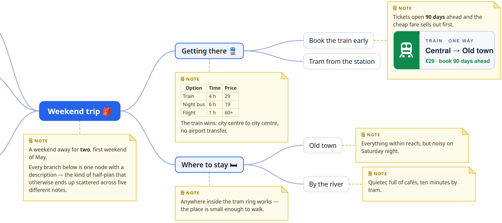

# UMind <sub></sub>

**Think in an outline, share as a picture.**

UMind is a minimalist, self-hosted mind-mapping application where you **write the map as a nested list instead of drawing it on a canvas**.
The outline directly represents the tree structure: every node has a title and an optional Markdown description.
From this textual representation, UMind automatically generates a balanced graphical mind map while preserving the order of the nodes.
One HTML file, plain JavaScript, no build step, no account, no cloud.
Your maps live in your browser and in `.json` files you own.

**▶ Try it live:** **https://pponec.github.io/UMind/?welcome**

[](docs/images/graph-example.png)

<sup>The picture above is real UMind output — every node, every description, one SVG file.
Click it for full size.</sup>

## Two modes, one document

### ✍️ Edit — hands stay on the keyboard

The editor is an **outliner**: a nested list you grow by typing.
Unlike traditional mind-map editors, you never position nodes manually.
The text structure is the source of truth, and the graphical layout is generated automatically.

| Key | Does |
|---|---|
| <kbd>Enter</kbd> | new node below |
| <kbd>Tab</kbd> / <kbd>Shift</kbd>+<kbd>Tab</kbd> | indent / outdent |
| <kbd>↑</kbd> <kbd>↓</kbd> | move between nodes |
| <kbd>Alt</kbd>+<kbd>↑</kbd> / <kbd>Alt</kbd>+<kbd>↓</kbd> | reorder among siblings |
| <kbd>Alt</kbd>+<kbd>Enter</kbd> | write a **description** (Markdown) |
| <kbd>Backspace</kbd> on an empty node | delete it, keep its children |
| <kbd>Ctrl</kbd>+<kbd>Z</kbd> / <kbd>Ctrl</kbd>+<kbd>Shift</kbd>+<kbd>Z</kbd> | undo / redo |

The mouse is welcome too: drag the ⠿ grip to move a branch anywhere, click ▸ / ▾ to fold one away.

### 🖼 Present — one click to a picture

**Show graph** transforms the outline into a graphical mind map: the root in the middle, branches fanning left and right, curved connectors, and every description drawn as a note beside the node it belongs to — **rendered Markdown**, with lists, tables, code and links intact.

- The layout is computed for you, and packs itself so a long note never pushes the rest of the map down.
- Always light, whatever your theme, so it prints and shares well.
- The picture signs itself: logo, project name and export date in the corner.
- **Download SVG** saves it; text stays text, so it scales to any size.

## Why you might like it

- **Write first, arrange never.**
  Focus on your ideas in a keyboard-friendly outline while UMind takes care of the visual layout.
- **Your data stays yours.**
  Everything is auto-saved in your browser; *Save* and *Open* move plain `.json` files to and from your disk.
  Nothing is ever sent to a server — there is no server.
  (Which also means sharing is a deliberate act: [send the file](#where-your-maps-live--and-how-to-share-one).)
- **Nothing to install.**
  Copy `docs/` onto any static host — or open it straight from GitHub Pages, as above.
- **Nothing to learn.**
  If you can write a bullet list, you can use it.
- **No lock-in and no bloat.**
  Around 3 000 lines of vanilla JavaScript, zero dependencies, Apache License 2.0.

## Desktop first

UMind is built around a keyboard, and it shows.
On a phone — Android in particular — the on-screen keyboard opens as soon as you touch a node and covers a good part of the screen, which leaves little room for the map you are editing.
Reading a map, folding branches and looking at the picture are fine on a small screen; typing into one is cramped.
Making the phone a comfortable place to *write* a map is not on the roadmap.

## Quick start

Open the `run.html` page in your browser from the project root directory.
You can also run the application on a local server.

```
python3 run.py       # then open http://localhost:8000/
```

No Python?
`java run.java` does the same (Java 17+, no build step).
Both take an optional port: `python3 run.py 9000`.
A plain static server works too:

```
python3 -m http.server -d docs 8000
```

Opening `docs/index.html` via `file://` also works, but browsers may switch localStorage off there; use **Save** / **Open** to keep a `.json` file instead.

## Where your maps live — and how to share one

**In your browser, and nowhere else.**
Every change is auto-saved to that browser's **localStorage** under the project's name.
There is no server, no account and no sync: nothing you type ever leaves your machine.

localStorage is a standard part of **every** browser, so auto-save needs nothing special — no Chrome, no extension, no permission prompt.
(The one browser-specific nicety is *Save* writing straight back to a real file on disk, which needs the File System Access API and therefore Chromium; everywhere else the same button simply downloads the file.
Serve the app over `http` rather than opening it as `file://`, where some browsers do switch storage off.)

That also means a map is **private to one browser on one device**.
It is not visible to anyone else, and it will not follow you to your phone or to another browser on the same computer.
Clearing the browser's site data removes it.
**To share a map — or move it — send the file:**

1. **Save** (or **Save As…**) writes the whole document to a `.json` file.
2. Send that file, drop it in a shared folder, commit it to a repository — it is plain text.
3. The other side presses **Open…** and picks it up.
   For a read-only copy that anyone can look at without UMind, use **Show graph → Download SVG**: one self-contained picture, viewable in any browser.

## The address bar is part of the app

The query is simply the project's name, optionally with a `/graph` tail — so delete the tail and you are editing the same map.

| URL | Opens |
|---|---|
| `…/UMind/` | the project you had open last |
| `…/UMind/?my-map` | the project saved as `my-map` |
| `…/UMind/?my-map/graph` | its picture |
| `…/UMind/?demo.json` | a **shared** read-only map file (shown as a picture) — see below |
| `…/UMind/?welcome` | the guided welcome map |

> **A link is not a copy.**
> `?my-map` picks a project out of *your own* browser storage.
> Sending that URL to somebody else opens *their* browser with no such project — send them the `.json` file instead (see above).
> `?welcome` is the exception, because it carries no data of its own: it is always safe to share.
> The welcome map is a preview that is never saved, your own maps stay untouched, and a plain reload returns to your work.

**The `.json` suffix is the switch.**
A name *without* it — `?my-map` — opens a **private** project from *your own* browser storage.
A name *ending* in `.json` — `?demo.json` — instead **fetches a file the site publishes**, a real `.json` served from the app's own `data/` folder:

```
https://pponec.github.io/UMind/?demo.json
```

Such a **shared map** opens as a read-only picture, is never auto-saved, and re-reads the file on every visit — so it is the one kind of link you *can* hand to somebody else and trust that they see the same map.
Pressing **Edit map** forks a private, editable copy into their browser without ever touching the published file.
Publishing one is just dropping a `.json` into `docs/data/` (see [Try the demo maps](#try-the-demo-maps) below).

## Images in node descriptions

Descriptions are Markdown, so they can embed images with ``.
How `src` resolves is governed by the browser's security model:

| `src` value | Result |
|---|---|
| `https://example.com/pic.png` | Loads from that server. Works anywhere. |
| `images/pic.png` (relative) | Resolved against the **page's own location**: served over `http` that is the deployed app (e.g. `https://…github.io/UMind/images/pic.png`), opened via `file://` it is the folder next to `index.html`. Either way the image must sit alongside the app — a relative path never reaches an arbitrary place on the visitor's disk. |
| `file:///home/me/pic.png` | **Blocked.** Browsers refuse to load `file://` from a page served over `http`/`https`. |
| `data:image/png;base64,…` | Embedded inline; works everywhere. Note it is stored in the document JSON / localStorage, so keep such images small. |

## Under the hood

The whole app is a handful of static files in **`docs/`** — `index.html`, `app.js`, `markdown.js`, `svg-export.js`, `welcome.js`, `style.css` — which is exactly what GitHub Pages publishes (**Deploy from a branch → `/docs`**).

- **Vanilla JavaScript.**
  Not a version but an approach: no framework, no library, no bundler, no polyfills, no ES modules — just `<script src="…">`.
- **ECMAScript 2017.**
  The newest syntax used is `async`/`await`; no optional chaining or other ES2020+ constructs.
- **Runs in any evergreen browser from late 2023** — Chrome/Edge 105+, Safari 15.4+, Firefox 121+.
  (The limits are the CSS `:has()` selector and Pointer Events, not the JavaScript.)
  Saving to a real file on disk uses the File System Access API where available (Chromium) and falls back to a download plus file picker everywhere else.
- The Markdown renderer is our own — a JavaScript port of Ujorm's `MarkdownToHtmlConverter` — and builds DOM nodes, so all text is escaped by construction.

## Security

UMind is **only** HTML, CSS and JavaScript running inside the visitor's browser tab.
That is not a corner cut — it *is* the security model, and it is worth being explicit about what it does and does not allow, especially when the app is served from a static host such as **GitHub Pages**.

- **JavaScript has no reach into your computer — by design.**
  A web page cannot read your files, list your folders or run programs; the browser sandbox forbids it.
  UMind keeps maps in `localStorage` (its own private slot in your browser) and touches the disk *only* through a file picker **you** open with **Save** / **Open** — one file you choose, when you choose it.
  Nothing scans your drive, and there is no API that could.

- **A static host runs no code of yours.**
  On GitHub Pages — or any static server — there is no backend, no database, no session and no credentials: the server only hands out files.
  It cannot receive, log or store anything you type, because nothing you type is ever sent to it.

- **Shared map files are read-only and locked to one folder.**
  A `?name.json` URL fetches from the app's own `data/` folder and nowhere else: the name must be a bare file name (`/^[a-z0-9._-]+\.json$/i`), a `..` is rejected outright, and the request is same-origin — there is no path to traverse toward the rest of the server.
  A shared map opens as a read-only picture; **Edit map** forks a private copy into your browser and never writes back to the published file.

- **Markdown is rendered, not executed.**
  The description renderer builds DOM nodes and sets text through `textContent`, so every character is escaped by construction — there is no `innerHTML` path for markup to slip in.
  The `javascript:`, `vbscript:` and `data:` link schemes are refused (images may use `data:`, links may not), and a `file://` reference is blocked by the browser (see [Images in node descriptions](#images-in-node-descriptions)).
  Because there is no server logic, the most a hosted UMind can do to a visitor is show them a map — and the reverse holds just as firmly: it can learn nothing about them.

## Try the demo maps

The [`docs/data/`](docs/data/) folder ships a set of ready-made **shared, read-only** maps.
Each link below opens the live app and renders that map as a **picture** — press **Edit map** in the corner to fork an editable copy into your own browser.
A quick way to see what the picture engine handles:

| Map | Shows |
|---|---|
| [`?demo.json`](https://pponec.github.io/UMind/?demo.json) | a short intro to the sharing feature |
| [`?demo-trip.json`](https://pponec.github.io/UMind/?demo-trip.json) | the map pictured at the top of this page |
| [`?demo-note-sizes.json`](https://pponec.github.io/UMind/?demo-note-sizes.json) | descriptions from one line to very long |
| [`?demo-deep-nesting.json`](https://pponec.github.io/UMind/?demo-deep-nesting.json) | five levels of structure |
| [`?demo-tree-shapes.json`](https://pponec.github.io/UMind/?demo-tree-shapes.json) | branches of wildly different shape |
| [`?demo-notes-everywhere.json`](https://pponec.github.io/UMind/?demo-notes-everywhere.json) | a description on every single node |
| [`?demo-markdown-notes.json`](https://pponec.github.io/UMind/?demo-markdown-notes.json) | tables, code, quotes, escaping |

Publish your own the same way — drop a `.json` into `docs/data/` and open it as `?your-file.json`; the [folder README](docs/data/README.md) has the details and the naming rules.

## License

[Apache License 2.0](LICENSE) — free to use, modify and self-host, with an explicit patent grant.

## Similar open-source projects

Other lightweight, actively maintained, browser-based mind-map / outliner projects with an English UI that (like UMind) run fully offline and keep your data in a plain file:

- **[Mind Elixir](https://github.com/SSShooter/mind-elixir-core)** — Framework-agnostic JavaScript/TypeScript mind-map core with a clean, fast UI; runs entirely in the browser, imports and exports the whole map as JSON, and also exports PNG/SVG.
  Where UMind is a ready-to-use app, this is a building block for developers: you embed it in your own project and drag nodes around a canvas instead of typing an outline.
  MIT.
- **[Markmap](https://github.com/markmap/markmap)** — Turns plain Markdown into an interactive mind map (via D3.js) and can generate self-contained offline HTML files, so a single `.md` file stays the source of truth.
  It draws a map from Markdown you write in your own editor, so it shines at displaying a document — whereas UMind is the place you actually build and grow the map.
  MIT.
- **[jsMind](https://github.com/hizzgdev/jsmind)** — Small, dependency-free JavaScript mind-map library that renders and edits in the browser (SVG/canvas) and loads/saves the map as JSON.
  Like Mind Elixir, it is a library that draws a diagram rather than a finished, keyboard-driven app you can simply open and start writing in.
  BSD.

## Read more

UMind is introduced on `dev.to`, walked through with one example — planning a weekend trip:

**[UMind: Write Mind Maps as a Nested Outline](https://dev.to/pponec/umind-write-mind-maps-as-a-list-39j1)**
